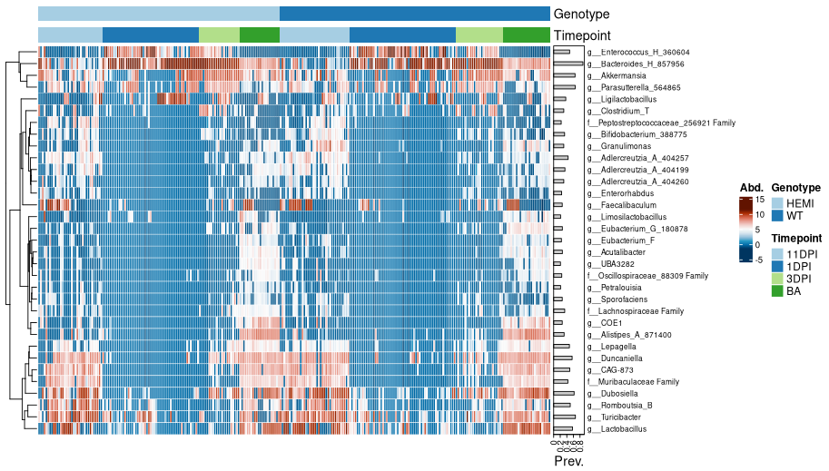

## Introduction

This vignette contains all of the code necessary for the microbiome analysis within our paper named "". The gut microbiome analysis of this study was performed through short-read 16S V1-V3 sequencing performed at Baylor College of Medicine with raw fastq data accessible at BioProject [PRJNA1104663](https://www.ncbi.nlm.nih.gov/bioproject/PRJNA1104663).

Much of the data and visualizations here had slight visual touching up in photoshop/coreldraw just to make them look _perf_ prior to submission, so if you see a difference between the figures produced here and those found within our paper that is why.

In the beginning of this markdown, we will perform all the steps needed to process short-read 16S data using [dada2](https://github.com/benjjneb/dada2), with a big shoutout to Dr. Ben Callahan for the beginning chunks of this from [STAMPS 2024 workshop](https://github.com/mblstamps/stamps2024).

## Load dependencies

```{r, eval=FALSE}
library(dada2)
library(dplyr)
library(tidyr)
library(janitor)
library(biomformat)
library(Biostrings)
library(tibble)
library(digest)
library(phyloseq)
library(microViz)
library(ggplot2)
library(ggprism)
library(ggsci)
library(forcats)
library(FSA)
library(ggsignif)
library(ggpubr)
library(broom)
library(ape)
library(igraph)
library(visNetwork)
library(SpiecEasi)
library(progressr)
library(furrr); plan(multisession, workers = 72)
```

## Process fastq data with DADA2

More work similar to this can be found the [DADA2 tutorial](https://benjjneb.github.io/dada2/tutorial.html).

```{r, eval=FALSE}
# Where is the freshly downloaded data?
list.files()
path <- "/condo/neurobiome/tmhagm8/fmtad_wabx/fastqs/fastqs"

# Read in the forward and reverse fastq file names
fnFs <- list.files(path, pattern="_R1_001", full.names=TRUE)
fnRs <- list.files(path, pattern="_R2_001", full.names=TRUE)
head(fnFs)

# Get the qualities of all samples
#plotQualityProfile(fnFs)
#plotQualityProfile(fnRs)

# Define the paths to filtered files we are going to create
filtFs <- file.path(path, "filtered", basename(fnFs)) 
filtRs <- file.path(path, "filtered", basename(fnRs))

# Perform filtering and trimming
out <- filterAndTrim(fnFs, filtFs, fnRs, filtRs, maxEE=2, 
                     trimLeft=c(17, 21),
                     truncLen=c(275, 265),
                     multithread = TRUE) 
head(out)
```

Plot errors and run DADA2

```{r, eval=FALSE}
# Learn the error model from the filtered data.
errF <- learnErrors(filtFs, multi=TRUE)
errR <- learnErrors(filtRs, multi=TRUE)

# Visualize the error model. Points are observations, black line is fitted error model.`
plotErrors(errF, nominalQ = TRUE)
plotErrors(errR, nominalQ = TRUE)

# Run the DADA2 method using the fitted error model.
ddF <- dada(filtFs, errF, pool=FALSE, multi=TRUE)
ddR <- dada(filtRs, errR, pool=FALSE, multi=TRUE)
```

Merging reads, make sequence table, and remove chimeras

```{r, eval=FALSE}
# Merge the denoised forward and reverse reads together.
mm <- mergePairs(ddF, filtFs, ddR, filtRs, verbose=TRUE)
# Were most reads retained during merging. If not, why not?

# Construct a sequence table: rows are samples, columns are ASVs, values are abundances.
# ASVs (columns) are ordered by their summed abundance across all samples.
sta <- makeSequenceTable(mm)
dim(sta)

# Remove chimeric ASVs and construct a new chimera-free sequence table.
st <- removeBimeraDenovo(sta, multi=TRUE, verbose=TRUE)
sum(st)/sum(sta)

saveRDS(st, file = "data/fmtad_wabx_st.rds")
```

Sanity check

```{r, eval=FALSE}

#st = readRDS("fmtad_wabx_st.rds")

# Code derived from the dada2 tutorial: https://benjjneb.github.io/dada2/tutorial.html
getN <- function(x) sum(getUniques(x))
track <- cbind(out, sapply(ddF, getN), sapply(ddR, getN), sapply(mm, getN), rowSums(st))
colnames(track) <- c("input", "filtered", "denoisedF", "denoisedR", "merged", "nonchim")
rownames(track) <- basename(fnFs)
head(track)
```
Assign taxonomy

```{r, eval=FALSE}
# Assign taxonomy down to the genus level to these 16S ASVs.
tax <- assignTaxonomy(st, "/home/tmhagm8/scratch/dada2/gg2_2024_09_toSpecies_trainset.fa.gz",
                      multi=TRUE)
unname(head(tax)) # unname strips the long ASV rownames to make the printed output more readable
```

Prepare phyloseq inputs

```{r, eval=FALSE}
# Metadata file
samdf <- read.csv("/condo/neurobiome/tmhagm8/fmtad_wabx/data/metadata.csv",
                    check.names = FALSE, header = TRUE, row.names = 1)

# Change the sample names in st to match metadata
rownames(st) <- gsub("_R1_001\\.fastq$", "", rownames(st))
```

Make ASV fasta for phylogenetics

```{r, eval=FALSE}
# lets make our rep-seqs.fasta file to process the ASV's with mafft and fasttree
# In 'dada2', the columns of 'st' are the unique ASV sequences.
seqs <- colnames(st)

# Create a short "ASV name" by MD5 hashing each sequence
asv_ids <- vapply(seqs, digest, FUN.VALUE = character(1), algo = "md5")

# Write out a FASTA file where:
# >asv_id
# SEQUENCE
output_fasta <- "rep-seqs.fasta"
fileConn <- file(output_fasta, "w")

for (i in seq_along(seqs)) {
  # Write a FASTA header (">...") followed by the actual sequence
  cat(">", asv_ids[i], "\n", seqs[i], "\n", sep = "", file = fileConn)
}

close(fileConn)
```


## Run MAFFT & FastTree in CLI

To create the phylogenetic tree of our ASV sequences I turned to using my SLURM HPC and ran the following script with the rep-seqs.fasta file we created above.
I created a conda environment that had MAFFT and FastTree installed to run this.

```{r, engine = 'bash', eval = FALSE}
#! /bin/bash

#SBATCH --time=04-00:00:00
#SBATCH --partition=defq
#SBATCH --mem=192GB
#SBATCH --mail-user=myemail@myemail.org
#SBATCH --mail-type=BEGIN,END,FAIL
#SBATCH --ntasks-per-node=64
#SBATCH --nodes=1
#SBATCH --job-name=sr_16S
#SBATCH --comment=sr_16S

module load mamba
mamba activate sr_16S

DIR="$PWD"

mafft --maxiterate 1000 --genafpair --thread 64 "$DIR/rep-seqs.fasta" > "$DIR/rep-seqs-aln.fasta"

FastTree -nt -gtr "$DIR/rep-seqs-aln.fasta" > "$DIR/rep-seqs.tree"
```

Match ASV names 

```{r, eval=FALSE}
#Now lets make the ASV names match for the phyloseq merging with tree

# 'seqs' are the raw DNA sequences currently in colnames(st)
seqs <- colnames(st)

# For each sequence, compute the MD5 hash
hash_ids <- vapply(seqs, digest, FUN.VALUE = character(1), algo = "md5")

# Rename the columns of 'st'
colnames(st) <- hash_ids
head(colnames(st))

# Rename the tax df with ASV 
rownames(tax) <- hash_ids
```

Make phyloseq object

```{r, eval=FALSE}
# Use phyloseq to plot a bray-curtis NMDS odrination of our samples, colored by treatment.
ps <- phyloseq(sample_data(samdf), otu_table(st, taxa_are_rows=FALSE), tax_table(tax))

# Now we read in the phylo tree computed by qiime2
tree <- read.tree("data/rep-seqs.tree")

# And add it to our phyloseq object
physeq <- merge_phyloseq(ps, phy_tree(tree))

# Add the ASV sequences to the refseq phyloseq slot
dna <- DNAStringSet(seqs)
names(dna) <- hash_ids  # must match the renamed colnames(st)
physeq <- merge_phyloseq(physeq, refseq(dna))

physeq <- physeq |>
  tax_fix()

saveRDS(physeq, file = "data/fmtad_wabx_physeq.rds")
```

I just use this to reload the rds object we saved when I'm running again

```{r, eval=FALSE}
# Make sure to run the libraries chunk

setwd("/condo/neurobiome/tmhagm8/fmtad_wabx/fmt_ad_w_abx")

physeq = readRDS("data/fmtad_wabx_physeq.rds")
```

## Diversity analyses and vizualization

Up to this point our work is solid, from here on out I want us to write some code chunks we can use for all 16S analyses. I implemented [MicroViz](https://github.com/david-barnett/microViz) for clr relative abundance and ordination plotting, and diversity estimations with the use of [ANCOMBC2](https://github.com/FrederickHuangLin/ANCOMBC) for differential abundance approximations.

__For all microbiome analyses__
How to pick a threshold? --> Depends on what analysis method you are filtering for!

* Alpha diversity = DO NOT FILTER
* Beta diversity = relevance of threshold depends on your distance measure
* Differential abundance testing = stringent filtering, prevalence >5%, >10%?

If you're unsure, check out the [MicroViz documentation](https://david-barnett.github.io/microViz/) or read some Amy Willis' [statdivlab](https://github.com/statdivlab) papers!

__Shannon Diversity Calculation__

We took the shannon_species value for each covariate and plotted the values in our Prism document.

```{r Shannon, eval=FALSE}
# Calculate Shannon
shan_data <- physeq |>
  ps_calc_diversity(rank = "unique", index = "shannon") |>
  samdat_tbl()

shan_filt <- shan_data |>
  select(MouseID, Genotype, Treatment, Timepoint, Sex, Injury, shannon_unique)

write.csv(shan_filt, file = "data/fmtad_wabx_shannon.csv")
```


__Chao1 Richness Calculation__

Same thing this time except using the Chao1 index

```{r Chao1, eval=FALSE}
# Calculate Chao1 richness
chao1_data <- physeq |>
  ps_calc_richness(rank = "unique", index = "chao1") |>
  samdat_tbl()

chao1_filt <- chao1_data |>
  select(MouseID, Genotype, Treatment, Timepoint, Sex, Injury, chao1_unique)

write.csv(chao1_filt, file = "data/fmtad_wabx_chao1.csv")
```


__Intro to beta diversity__

This is useful for seeing where we want to filter our data for beta diversity (only light filtering).

```{r, eval=FALSE}
# gotta start of with read filtering
physeq |>
  ps_mutate(reads = sample_sums(physeq)) |> #this will get you read depth!
  samdat_tbl() |>
  ggplot(aes(x = reads)) +
  geom_freqpoly(bins = 100) +
  geom_rug(alpha = 0.5) +
  scale_x_log10(labels = scales::label_number()) +
  labs(x = "Number of classified reads", y = NULL) +
  theme_bw()

# lets find where we should filter our data
ps_Stats <- tibble(
  taxon = taxa_names(physeq),
  prevalence = microbiome::prevalence(physeq),
  total_abundance = taxa_sums(physeq)
)

# plot 
p <- ps_Stats |>
  ggplot(aes(total_abundance, prevalence)) +
  geom_point(alpha = 0.5) +
  geom_rug(alpha = 0.1) +
  scale_x_continuous(
    labels = scales::label_number(), name = "Total Abundance"
  ) +
  scale_y_continuous(
    labels = scales::label_percent(), breaks = scales::breaks_pretty(n = 9),
    name = "Prevalence (%)",
    sec.axis = sec_axis(
      trans = ~ . * nsamples(physeq), breaks = scales::breaks_pretty(n = 9),
      name = "Prevalence (N samples)"
    )
  ) +
  theme_bw()

# and add the taxa labels 
p + ggrepel::geom_text_repel(
  data = function(df) filter(df, total_abundance > 1e9 | prevalence > 0.6),
  mapping = aes(label = taxon), size = 2.5, min.segment.length = 0, force = 15)

ggsave("data/div_stats.png", height = 5, width = 7, units = "in")

# these params were chosen as a compromise with Amy Willis' advice (STAMPS 2024)
```


Now we have an idea on how to filter our data for beta diversity analyses, we start by subsetting for Treatments then plot using weighted unifrac distance PCoA. We also compute the permanova values between groups which was added to the figure later using CorelDRAW.

```{r, eval=FALSE}

#View(sample_data(physeq))

timepoint_colors <- c("BA" = "#007bff", "1DPI" = "#ffcc00", "3DPI" = "#ff0000","11DPI" = "#008000")

treatment_colors <- c("VEH" = "#007bff", "FMT" = "#ff0000")

ps_veh <- subset_samples(physeq, Treatment == "VEH") 
ps_fmt <- subset_samples(physeq, Treatment == "FMT") 

# ps_veh_m <- subset_samples(physeq, Treatment == "VEH" & Sex == "M")
# ps_veh_f <- subset_samples(physeq, Treatment == "VEH" & Sex == "F")
# ps_fmt_m <- subset_samples(physeq, Treatment == "FMT" & Sex == "M")
# ps_fmt_f <- subset_samples(physeq, Treatment == "FMT" & Sex == "F")

ps_ba <- subset_samples(physeq, Timepoint == "BA")
ps_1dpi <- subset_samples(physeq, Timepoint == "1DPI")
ps_3dpi <- subset_samples(physeq, Timepoint == "3DPI")
ps_11dpi <- subset_samples(physeq, Timepoint == "11DPI")

# ps_wt_veh <- subset_samples(physeq, Genotype == "WT" & Treatment == "VEH")
# ps_wt_fmt <- subset_samples(physeq, Genotype == "WT" & Treatment == "FMT")
# ps_hemi_veh <- subset_samples(physeq, Genotype == "HEMI" & Treatment == "VEH")
# ps_hemi_fmt <- subset_samples(physeq, Genotype == "HEMI" & Treatment == "FMT")

# ps_m_wt_veh <- subset_samples(physeq, Sex == "M" & Genotype == "WT" & Treatment == "VEH")
# ps_m_wt_fmt <- subset_samples(physeq, Sex == "M" & Genotype == "WT" & Treatment == "FMT")
# ps_m_hemi_veh <- subset_samples(physeq, Sex == "M" & Genotype == "HEMI" & Treatment == "VEH")
# ps_m_hemi_fmt <- subset_samples(physeq, Sex == "M" & Genotype == "HEMI" & Treatment == "FMT")
# ps_f_wt_veh <- subset_samples(physeq, Sex == "F" & Genotype == "WT" & Treatment == "VEH")
# ps_f_wt_fmt <- subset_samples(physeq, Sex == "F" & Genotype == "WT" & Treatment == "FMT")
# ps_m_hemi_veh <- subset_samples(physeq, Sex == "F" & Genotype == "HEMI" & Treatment == "VEH")
# ps_m_hemi_fmt <- subset_samples(physeq, Sex == "F" & Genotype == "HEMI" & Treatment == "FMT")

# Generate the plot with custom colors for densities and sample points
ps_11dpi |>
  tax_filter(min_prevalence = 2 / 100, verbose = FALSE, min_total_abundance = 50) |>
  tax_transform(trans = "compositional", rank = "unique") |>
  dist_calc(dist = "wunifrac") |>
  ord_calc("PCoA") |>
  ord_plot(color = "Treatment", shape = "Genotype", size = 2) +
  scale_color_manual(values = treatment_colors, name = "Treatment") +
  scale_fill_manual(values = treatment_colors, name = "Treatment") +
  theme_prism() +
  ggtitle("11dpi by Treatment and Genotype") +
  ggside::geom_xsidedensity(aes(fill = Treatment), alpha = 0.5, show.legend = FALSE) +
  ggside::geom_ysidedensity(aes(fill = Treatment), alpha = 0.5, show.legend = FALSE) +
  ggside::theme_ggside_void() +
  theme(
    axis.title.x = element_text(size = 14),
    axis.title.y = element_text(size = 14),
    axis.text.x = element_text(size = 14),
    axis.text.y = element_text(size = 14),
    plot.title = element_text(size = 14),
    
  )

#ggsave("data/11dpi_treat_geno_wuni.png", height = 5, width = 7, units = "in")

#recompute distance for permanova
treat_dists <- ps_11dpi |>
  tax_filter(min_prevalence = 2 / 100, verbose = FALSE, min_total_abundance = 50) |>
  tax_transform(trans = "compositional", rank = "unique") |>
  dist_calc("wunifrac")

# the more permutations you request, the longer it takes
# but also the more stable and precise your p-values become
treat_perm <- treat_dists |>
  dist_permanova(
    seed = 1234, # for set.seed to ensure reproducibility of random process
    n_processes = 1, n_perms = 999, # you should use at least 999!
    variables = "Timepoint"
  )

# view the permanova results
treat_permdf <- perm_get(treat_perm) |> as.data.frame()
#write.table(treat_permdf, file ="data/ps_3dpi_time_wuni_pcoa_permanova.tsv", sep = "\t")
```


## Relative abundance plots

Super useful to make your own palette and assign to certain taxa, this helps your viewers understand trends in this data. I altered this figure in coreldraw to widen it out and turn it vertically (with the facet labels).

```{r, eval=FALSE}
# Make your custom color palette
myPal <- tax_palette(
  data = physeq, rank = "Genus", n = 25, pal = "greenArmytage",
  add = c(Other = "gray")
)
tax_palette_plot(myPal)

physeq |>
  comp_barplot(
    tax_level = "Genus", n_taxa = 10,
    taxa_order = sum,
    sample_order = "bray", bar_outline_colour = NA,
  ) +
  facet_grid(
    rows = vars(Timepoint, Genotype),
    scales = "free", space = "free" # these options are critically important!
  ) +
  coord_flip() +
  theme(axis.text.y = element_blank(), axis.ticks.y = element_blank())

ggsave("data/relabund_genus.png", height = 5, width = 7, units = "in")
```


__Heatmaps of count data__

Heatmap of abundance with treatment groups, this is a heavily filtered subset but is needed for this type of figure. I prettied this up in coreldraw just by removing the legend and changing the order of the samples. Was not used in our manuscript but still nice to have

```{r, eval = FALSE}
# I do not know why this doesnt print when ggsaving so to save the figure i run this in a separate R script and save as pdf that way.

# Assign colors for Injury states
cols_injury <- distinct_palette(n = length(unique(samdat_tbl(physeq)$Timepoint)), add = NA)
names(cols_injury) <- unique(samdat_tbl(physeq)$Timepoint)

# Assign colors for Treatment states
cols_treatment <- distinct_palette(n = length(unique(samdat_tbl(physeq)$Genotype)), add = NA)
names(cols_treatment) <- unique(samdat_tbl(physeq)$Genotype)

# Create the heatmap with both Injury and Treatment annotations
physeq |>
  # Arrange samples by both Treatment and Genotype (i.e., both facets are sorted)
  ps_arrange(Genotype, Timepoint) |>
  # Apply CLR transformation on Genus level
  tax_transform("clr", rank = "Genus") |>
  # Filter taxa by prevalence and abundance
  tax_filter(min_prevalence = 0.2, verbose = FALSE, min_total_abundance = 1000) |>
  # Generate compositional heatmap using fixed sample order (no dendrogram)
  comp_heatmap(
    tax_anno = taxAnnotation(
      Prev. = anno_tax_prev(bar_width = 0.3, size = grid::unit(1, "cm"))
    ),
    sample_anno = sampleAnnotation(
      Genotype = anno_sample("Genotype"),
      Timepoint = anno_sample("Timepoint"),
      col = list(Timepoint = cols_injury, Genotype = cols_treatment),
      border = FALSE
    ),
    colors = heat_palette(palette = "RdBu", rev = TRUE),
    sample_seriation = "Identity"  # Use the order set by ps_arrange
  )

ggsave("data/geno_treat_htmp_genus.png", height = 5, width = 7, units = "in")
```



## Differential abudance analysis using Maaslin3

Differential abundance analysis for the three severity levels we investigated. For this analysis I wrote some code to convert a phyloseq object to a the Maaslin3 feature table and metadata table inputs. The Maaslin3 [github](https://github.com/biobakery/maaslin3) and [biobakery](https://forum.biobakery.org/c/downstream-analysis-and-statistics/maaslin/10) are great resources for anything you need to know about this program.

```{r, eval = FALSE}

# Subset your phyloseq object to compare diff things
ps2 <- subset_samples(ps, Timepoint == "3DPI")

# Extract the OTU table as a data frame
otu_df <- as.data.frame(otu_table(ps2))

# If taxa are stored as columns, transpose the table so rows correspond to OTUs
if (!taxa_are_rows(ps2)) {
  otu_df <- as.data.frame(t(otu_df))
}

# Add the OTU IDs (rownames) as a column
otu_df <- cbind(otu = rownames(otu_df), otu_df)

# Convert the phyloseq taxonomy table to a data frame
tax_df <- as.data.frame(tax_table(ps2))

# Check that the "Genus" column exists
if (!"Genus" %in% colnames(tax_df)) {
  stop("The taxonomy table does not contain a column named 'Genus'. Please verify your phyloseq object.")
}

# Add Genus information for each OTU by matching OTU IDs
otu_df$Genus <- tax_df[otu_df$otu, "Genus"]

# Rearrange columns to have "Genus" first (dropping the original OTU column)
otu_df <- otu_df[, c("Genus", setdiff(colnames(otu_df), c("Genus", "otu")))]

# Aggregate (sum) counts by Genus so each Genus appears only once
otu_df_agg <- otu_df %>%
  group_by(Genus) %>%
  summarise(across(everything(), sum)) %>%
  as.data.frame()

# Set rownames to the Genus names and remove the Genus column
rownames(otu_df_agg) <- otu_df_agg$Genus
otu_df_agg$Genus <- NULL

# Write the aggregated feature table with rownames
write.table(otu_df_agg,
            file = "data/maaslin3_feature_table_updated2.tsv",
            sep = "\t",
            quote = FALSE,
            row.names = TRUE,
            col.names = NA)

# ----- Create the Metadata File -----

# Extract sample metadata
metadata_df <- as.data.frame(sample_data(ps2))
metadata_df <- cbind(sample = rownames(metadata_df), metadata_df)

# Write the metadata to a TSV file
write.table(metadata_df,
            file = "data/maaslin3_metadata2.tsv",
            sep = "\t",
            quote = FALSE,
            row.names = FALSE,
            col.names = TRUE)

# ----- Read Files Back In (Ensuring Rownames are Preserved) -----

taxa_table <- read.delim("data/maaslin3_feature_table_updated2.tsv", 
                         check.names = FALSE,
                         header = TRUE,
                         row.names = 1)

metadata <- read.delim("data/maaslin3_metadata2.tsv", 
                       check.names = FALSE,
                       header = TRUE,
                       row.names = 1)

metadata$Timepoint <-
  factor(metadata$Timepoint, levels = c('BA', '1DPI', '3DPI', '11DPI'))

metadata$Treatment <-
  factor(metadata$Treatment, levels = c('VEH', 'FMT'))

metadata$Genotype <-
  factor(metadata$Genotype, levels = c('WT', 'HEMI'))

metadata$Injury <-
  factor(metadata$Injury, levels = c('Sham', 'TBI'))

metadata$Sex <-
  factor(metadata$Sex, levels = c('M', 'F'))

# Fit models
fit_out <- maaslin3(input_data = taxa_table,
                    input_metadata = metadata,
                    output = 'data/fmtad_wabx_maaslin3_3dpi_sex',
                    formula = 'Sex',
                    normalization = 'TSS',
                    transform = 'LOG',
                    augment = TRUE,
                    standardize = TRUE,
                    max_significance = 0.1,
                    median_comparison_abundance = TRUE,
                    median_comparison_prevalence = FALSE,
                    max_pngs = 100,
                    cores = 1,
                    save_models = TRUE)
```

Here is an example of a plot using this data that was made in GraphPad Prism

## Plot the Bifidobacterium / Akkermansia ratio

This idea comes from a recent [PNAS paper](https://www.pnas.org/doi/10.1073/pnas.2413953122) where the authors found an associated with this ratio and multiple sclerosis. It makes sense we may find a similar situation in Alzheimer's models so let's test it out!

```{r, eval=FALSE}
# subset for the mice with TBI
ps_tbi = subset_samples(physeq, Injury == "TBI")

# Data transformation pipeline:
plot_data <- ps_tbi %>%
  tax_fix() %>%
  tax_transform("compositional", rank = "Genus") %>%
  tax_transform("clr", zero_replace = "halfmin", chain = TRUE) %>%
  ps_get() %>%
  # Add Bifidobacterium and Akkermansia as separate sample data columns
  ps_otu2samdat("g__Bifidobacterium_388775") %>%
  ps_otu2samdat("g__Akkermansia") %>%
  # Convert sample data to a tibble before calling mutate
  samdat_tbl() %>%
  # Compute the clr ratio: clr(Bifidobacterium) - clr(Akkermansia)
  mutate(ratio = `g__Bifidobacterium_388775` - `g__Akkermansia`,
         # Reorder Genotype so that WT appears first and HEMI second
         Genotype = factor(Genotype, levels = c("WT", "HEMI")),
         # Ensure Timepoint is a factor in temporal order.
         # Adjust the levels as needed for your data.
         Timepoint = factor(Timepoint, levels = c("BA", "1DPI", "3DPI", "11DPI"))
         )

# plot_data$Timepoint <- factor(plot_data$Timepoint, levels = c("T1", "T2", "T3"))
# plot_data$Genotype  <- factor(plot_data$Genotype, levels = c("WT", "HEMI"))

# Create the box and whisker plot with facets by Timepoint:
p <- ggplot(plot_data, aes(x = Genotype, y = ratio)) +
  geom_boxplot(width = 0.5, colour = "grey35") +
  geom_jitter(width = 0.2, alpha = 0.5) +
  # Annotate with an overall ANOVA p-value for each facet (timepoint)
  stat_compare_means(method = "anova", label = "p.format") +
  facet_wrap(~ Timepoint, nrow = 1, scales = "free_x") +
  labs(x = "Genotype",
       y = "clr(Bifidobacterium/Akkermansia)",
       title = "Bifidobacterium / Akkermansia Ratio by Genotype") +
  theme_prism()

# If you want to color the point by treatment
# p <- ggplot(plot_data, aes(x = Genotype, y = ratio)) +
#   geom_boxplot(width = 0.5, colour = "grey35") +
#   # Map Treatment to color in the jitter points
#   geom_jitter(aes(color = Treatment), width = 0.2, alpha = 0.5) +
#   scale_color_manual(values = c("VEH" = "blue", "FMT" = "red")) +
#   # Annotate with an overall ANOVA p-value for each facet (timepoint)
#   stat_compare_means(method = "anova", label = "p.format") +
#   facet_wrap(~ Timepoint, nrow = 1, scales = "free_x") +
#   labs(x = "Genotype",
#        y = "clr(Bifidobacterium/Akkermansia)",
#        title = "Bifidobacterium / Akkermansia Ratio by Genotype Across Timepoints") +
#   theme_prism()

print(p)

ggsave("data/bif_akk_by_geno.pdf", height = 6, width = 8, units = "in")
```

